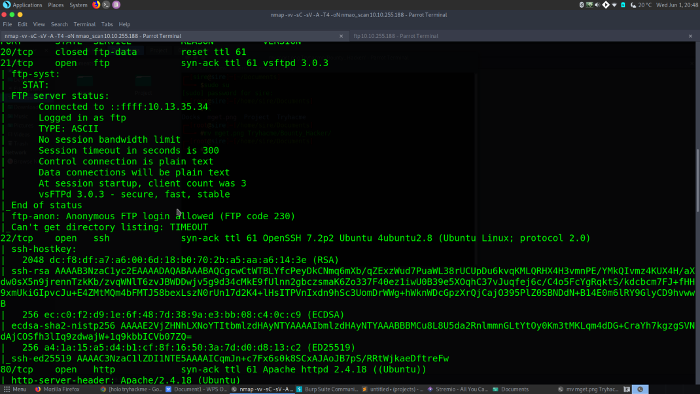
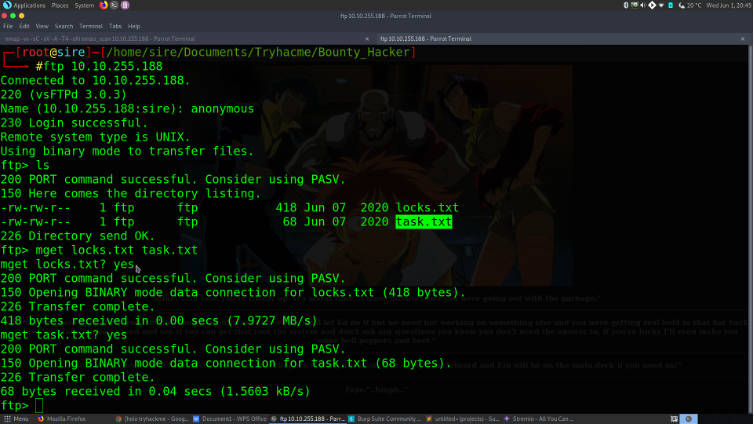
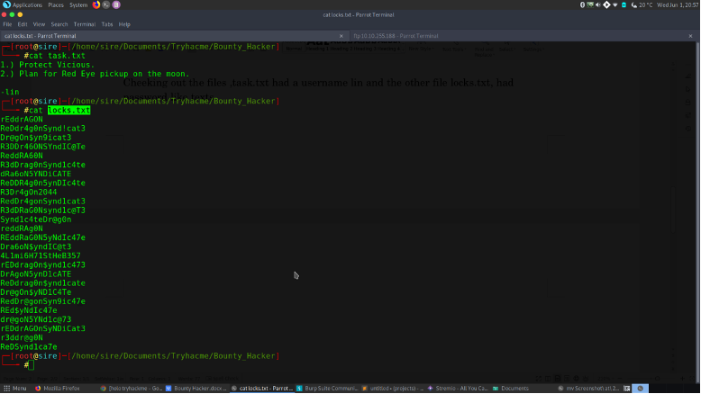
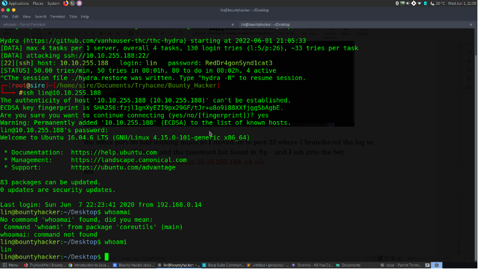
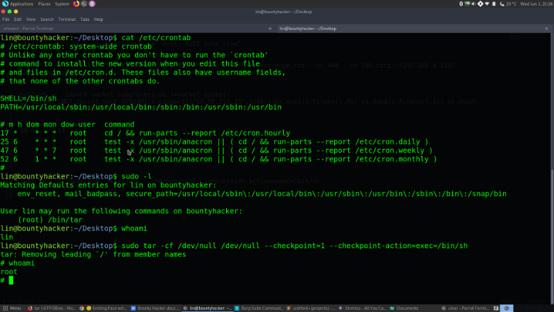

# Bounty Hacker

## Initial Recon with Nmap

 ```bash
 nmap -vv -sC -sV -A -T4 -oN nmap_scan 10.10.255.188
 ```



## Nmap Scan

Alot of ports are open under 1000 ports. But my attention was caught by 3 ports:

a) port 80 where there was a webserver.
b) port 22 of course because it is SSH.
c) port 21 FTP, and there was anonymous log in where there were 2 text files.


## FTP Recon (Port 21)




Checking out the files, task.txt had a username 'lin,' and the other file locks.txt had password-like texts.



SSH Brute Forcing (Port 22)

 ```bash
hydra -L username.txt -P locks.txt 10.10.255.188 -t4 ssh
 ```




SSH Brute Force

Lucky me, I was able to find Lin's password where I proceeded logging in.

I poked around everywhere, even checked crontab, and found nothing. But checking the allowed (and forbidden) commands for the invoking user 'lin' on the machine, I found luck. User Lin was allowed to run /bin/tar with root permission. Checking GTFOBins, I found a way to elevate my privilege to root with the following command:


 ```bash
sudo tar -cf /dev/null /dev/null --checkpoint=1 --checkpoint-action=exec=/bin/sh
 ```




Privilege Escalation


### MACHINE POWNED

## :)


